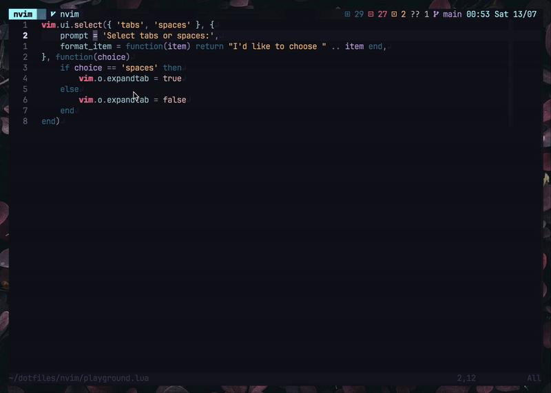

# FastAction.nvim

FastAction.nvim is a sleek, efficient plugin designed to optimize code actions
in Neovim. By leveraging Neovim's built-in LSP capabilities, it offers a simple
and intuitive interface that enhances your coding experience.

## Features

- **Popup Interface**: Display code actions in a customizable popup window.
- **Keybindings**: Configure keys to quickly dismiss or select code actions,
  making your workflow more efficient.
- **Priority Handling**: Customize the display order of actions based on
  priority, ensuring the most used actions are always visible on top.
- **Flexible Selection**: Extendable selection prompt that can replace Neovim's
  built-in `vim.ui.select`, providing more versatility in how you interact with lists

## Installation

Using `lazy.nvim`

```lua
  {
      'Chaitanyabsprip/fastaction.nvim',
      ---@type FastActionConfig
      opts = {},
  }
```

## Configuration

**fastaction.nvim** comes with sensible defaults to get you started quickly:

```lua
{
  popup = {
    dismiss_keys = { "j", "k", "<c-c>", "q" },
    border = "rounded",
    hide_cursor = true,
    highlight = {
      divider = "FloatBorder",
      key = "MoreMsg",
      title = "Title",
      window = "NormalFloat",
    },
    title = "Select one of:",
  },
  priority = {},
}
```

<details>
<summary>Example Configuration</summary>

```lua
{
  popup = {
    dismiss_keys = { "j", "k", "<c-c>", "q" },
    border = "rounded",
    hide_cursor = true,
    highlight = {
      divider = "FloatBorder",
      key = "MoreMsg",
      title = "Title",
      window = "NormalFloat",
    },
    title = "Select one of:",
  },
  priority = {
    dart = {
      { pattern = "organize import", key ="o", order = 1 },
      { pattern = "extract method", key ="x", order = 2 },
      { pattern = "extract widget", key ="e", order = 3 },
    },
    typescript = {
      { pattern = 'to existing import declaration', key = 'a', order = 2 },
      { pattern = 'from module', key = 'i', order = 1 },
    }
  }
}
```

</details>

## Usage

**fastaction.nvim** exposes three function apart from setup.

- `code_action()`: Displays code actions in a popup window.
- `range_code_action()`: Displays code actions in a popup window for a visual range.
- `select(items: any, opts: SelectOpts, on_choice: fun(item: any))`: Displays a
  selection prompt window.

To integrate these functions with your LSP mappings, add the following to your configuration:

```lua
    vim.keymap.set(
        'n',
        '<leader>a',
        '<cmd>lua require("fastaction").code_action()<CR>'
        { buffer = bufnr }
    )
    vim.keymap.set(
        'v',
        '<leader>a',
        "<esc><cmd>lua require('fastaction').range_code_action()<CR>",
        { buffer = bufnr }
    )
```

You can also use `require('fastaction').select` as a replacement for `vim.ui.select`.



## Credit

This repository is a fork of
[nvim-pack/lsp-fastaction.nvim](https://github.com/nvim-pack/lsp-fastaction.nvim)
building on its foundations to provide an even more streamlined and efficient experience.
